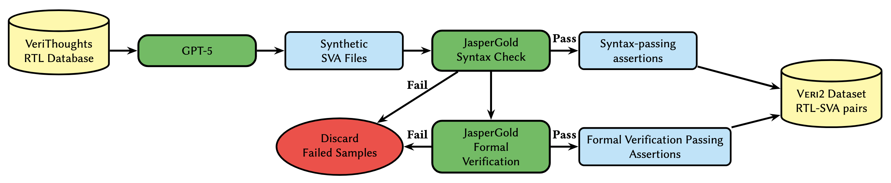
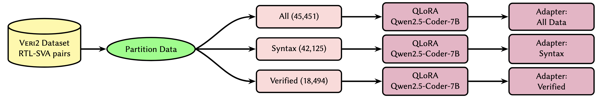

# Veri2: A Formally Verified RTL–SVA Dataset for Fine-Tuning Local Language Models

## Overview

Veri2 is a synthetic RTL–SVA dataset created through knowledge distillation from GPT-5 and filtered using a two-stage Cadence JasperGold verification pipeline. The project investigates whether formally verified training data can improve SystemVerilog Assertion (SVA) generation compared to larger but noisier datasets.

The repository contains:

* Dataset generation scripts
* GPT-5 batch API generation infrastructure
* Fine-tuning and inference code
* Generated adapter outputs
* Three Veri2 dataset tiers
* Evaluation artifacts used in the paper

The central hypothesis explored in this work is that **data quality outweighs data quantity** for SVA generation. Models trained on formally verified assertions consistently outperform models trained on substantially larger unfiltered datasets.

---

## Dataset Creation Pipeline



## Fine-Tuning Pipeline



---

## Repository Structure

```text
.
├── fine_tuning/
├── generation/
├── inference_outputs/
├── scripts/
├── veri2/
├── veri2_finetuning
└── veri2_pipeline
```

### `fine_tuning/`

Contains all code required for training and inference of QLoRA adapters.

Includes:

* Dataset preprocessing
* Training scripts
* QLoRA configuration
* Inference scripts
* Evaluation utilities

Adapters are trained on Qwen2.5-Coder-7B-Instruct using the dataset variants described below.

---

### `generation/`

Contains the GPT-5 generation infrastructure used to create synthetic SVA data.

Includes:

* OpenAI Batch API request creation
* JSONL generation
* Batch submission scripts
* Result retrieval
* Output post-processing

These scripts were used to generate assertions from RTL modules prior to verification filtering.

---

### `inference_outputs/`

Contains inference outputs for all evaluated models.

Examples include:

* Base Qwen
* GPT-5 Baseline
* Adapter (All)
* Adapter (Syntax Pass)
* Adapter (Verified)
* Adapter (VERT)

These outputs are used for downstream JasperGold evaluation.

---

### `scripts/`

Utility scripts used throughout the project.

Examples include:

* Dataset cleaning
* Statistics collection
* Data conversion
* Evaluation helpers
* Experiment automation

---

### `veri2/`

Contains the Veri2 dataset.

The dataset is organized into three quality tiers:

| Tier        | Description                                            |
| ----------- | ------------------------------------------------------ |
| All         | All GPT-5 generated RTL–SVA pairs                      |
| Syntax Pass | Only pairs passing JasperGold syntax validation        |
| Verified    | Only pairs passing both syntax and formal verification |

Dataset statistics:

| Tier        | Modules | Assertions |
| ----------- | ------- | ---------- |
| All         | 5,774   | 45,451     |
| Syntax Pass | 5,412   | 42,125     |
| Verified    | 2,954   | 18,494     |

---

## Dataset Construction

Veri2 is created using the following workflow:

1. Select verified RTL modules from VeriThoughts.
2. Generate assertions using GPT-5.
3. Run JasperGold syntax validation.
4. Run JasperGold formal verification.
5. Retain passing assertions for the verified dataset tier.

This process produces progressively higher-quality subsets that can be used to study the effect of training data quality on downstream SVA generation.

---

## Fine-Tuning

All adapters were trained using QLoRA on Qwen2.5-Coder-7B-Instruct.

### Key Hyperparameters

| Parameter            | Value |
| -------------------- | ----- |
| LoRA Rank            | 64    |
| LoRA Alpha           | 128   |
| Epochs               | 3     |
| Effective Batch Size | 16    |
| Learning Rate        | 2e-4  |
| Max Sequence Length  | 8192  |

---

## Evaluation

Models are evaluated using a multi-stage verification pipeline:

1. Assertion generation
2. Syntax validation
3. RTL elaboration / binding
4. Formal verification

### Primary Metric

**Yield** = Percentage of generated assertions that are formally proven by JasperGold.

The strongest-performing adapter is trained on the **Verified** dataset tier and achieves higher assertion yield than both the GPT-5 teacher model and models trained on larger, lower-quality datasets.

---

## Reproducibility

To reproduce the experiments, follow steps in /fine_tuning/sva_qlora_finetune.ipynb using data from /veri2.

---

## License

This repository is released for research and educational purposes. Please consult the accompanying license file for usage restrictions and third-party dependencies.
